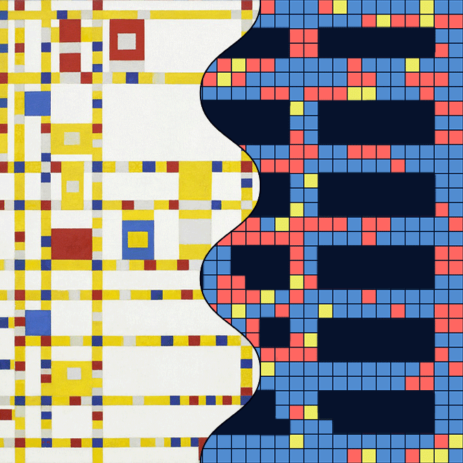
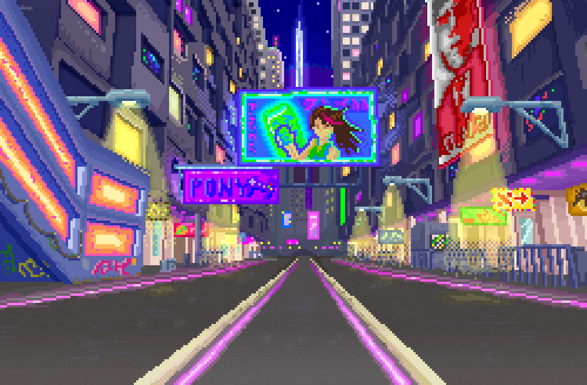
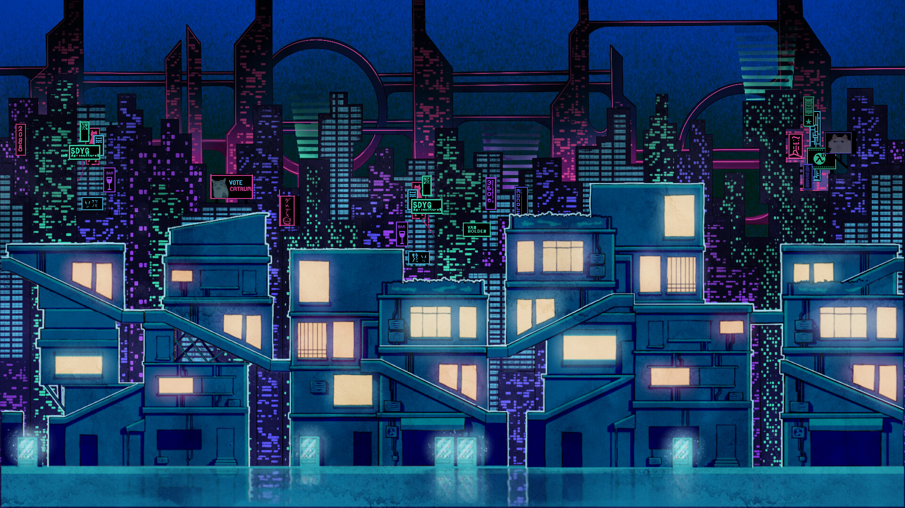

# 1. Project Description
This is the IDEA9103 Major Project individual task. The owner of this repository is **yzha3003**. Our group chose **Piet Mondrian's Broadway Boogie Woogie** as our artwork. Based on this, I used **Perlin noise** as the main animation driver to create smooth, natural, and irregular changes. The goal is to simulate the feeling of city streets at night, with building lights gently changing and LED signs flickering.

# 2. Interaction Instruction
No interaction is required. Simply open the page, and the animation will start automatically. Over time, small squares along the yellow lines gently change in brightness, and vertical bars appear inside coloured big blocks.

# 3. Details of Individual Approach
### - Method
I chose Perlin noise as the main technique to drive my individual animation. It creates smooth and natural variations over time, which I used to simulate the feeling of lights flickering and glowing in a city at night.
### - What Properties I Animated
- **Small squares on yellow lines:** Using Perlin noise, their brightness smoothly transitions between white and base colours (red, blue, grey). This creates a “breathing light” effect, simulating windows lighting up randomly in a nighttime city street.
- **Big coloured blocks:** Inside each block, thin vertical bars are randomly lit based on noise. These simulate flickering LED signs or neon billboards, creating contrast with the soft ambient glow of the smaller squares.
### - How It's Unique
My animation differs from my group members’ approaches:
- **Member A:** Animates elements based on audio input. Blocks change colour and move in sync with the beat of the music.
- **Member B:** Uses keyboard and mouse interaction. Clicking on blocks triggers falling squares in random colours, creating an interactive visual response.
- **Member C:** Animates block positions over time to form patterns
> *Note: Each member may make small adjustments to their intended effects depending on implementation. Please refer to the final outcomes.*
### - Inspiration
- 1. [Broadway Data Boogie Woogie -- Noah Garcia, Ivan Himanen](https://www.dxd2021.com/broadwaydataboogiewoogie)

- 2. [Pixel City -- Draggle](https://www.newgrounds.com/art/view/draggle/pixel-city)

- 3. [Pixel Night City -- N](https://www.artstation.com/artwork/RnoYnv)

These visuals inspired me to use Perlin noise to recreate the random rhythm of light in urban nightscapes.
### - Technical Implementation
### - Code Adjustments
### - Tools & References 

